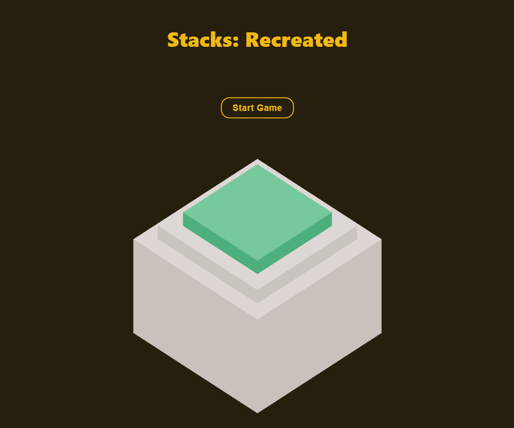
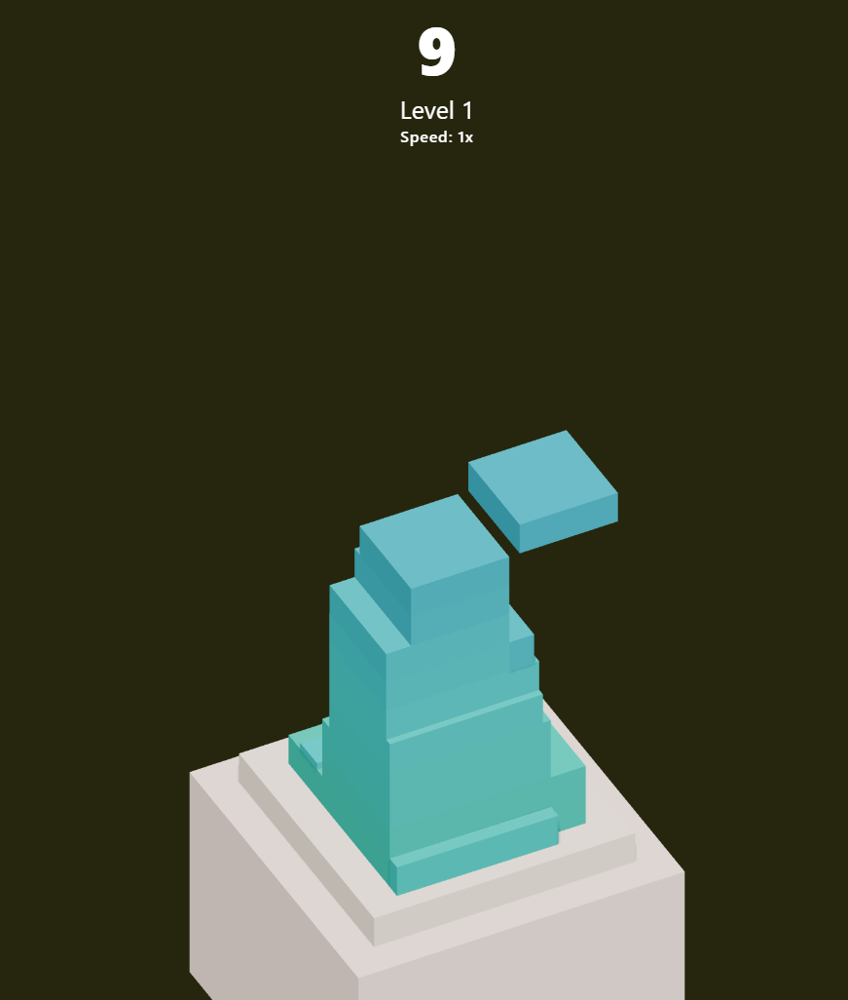
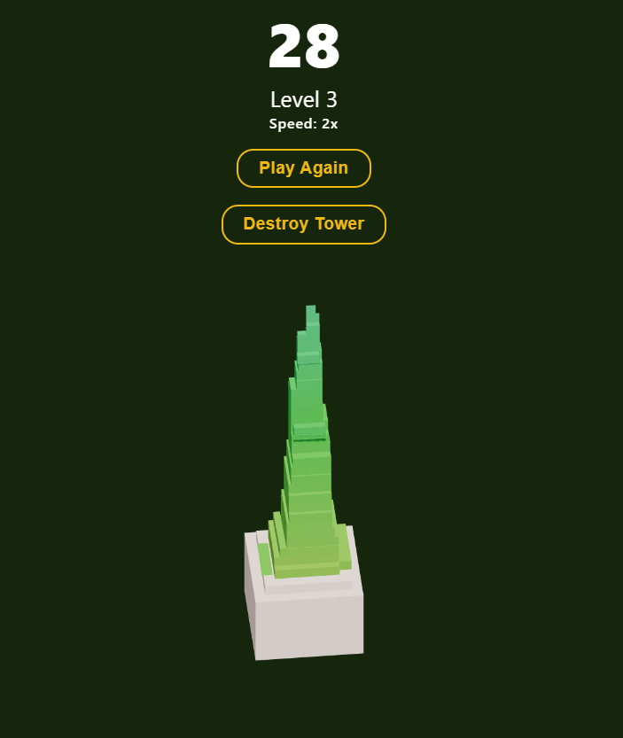
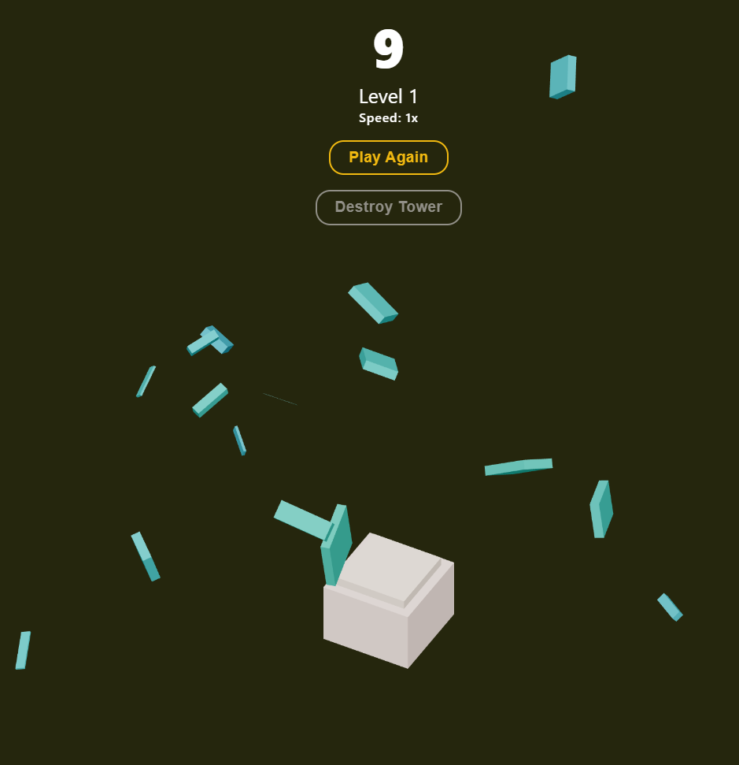

# Stacks

## Links
> ### [Live Link](https://stacks-iota.vercel.app/)

## Images 
**Start Screen**

**Playing Screen**

**Game Over Screen**

**Destroy Screen**

## Attributes
- [React Three Fiber](https://github.com/pmndrs/react-three-fiber) 
- [React Three Drei](https://github.com/pmndrs/drei) 
- [useCannon](https://github.com/pmndrs/use-cannon) 
- [Three](https://threejs.org//) 
- [Zustand]
- [Learn Three.js while building a 3D game with physics](https://www.youtube.com/watch?v=hBiGFpBle7E&t=1929s) - Thanks to this video for giving me the idea to make this in React Three Fiber and try to create it on my own. When I had difficulty, this was a great little tip helper!

## Skills Learned
* Giving physics to blocks
* Trigonometry...
* Learned to use zustand
* Understanding how to use React Three Fiber

## Reflection
This project was a really enjoyable one to make. It is satisfying to see that the ideas being brought to life on the screen. Seeing the physics and the blocks dropping was really cool to me. When making this project, it was my first time deeply interacting with React Three Fiber and using its way of building things. I definitely believe the way I have done it could have been improved but happy with progress. 

It is just cool to make a 3D world and I hope to continue making more fun projects like this. 

## Changes I will Make In My Next Project
* Continue doing planning sessions, writing out my goal of the day
* Brainstorm ahead of time the features I want to have
* Don't be afraid to experiment with THREE and REACT THREE FIBER
* Play around more with react use spring
* Make a Jenga!

## Timeline
This project was completed from **June 26th, Saturday, 2021** to **July 11th, Sunday, 2021**, spending around 6-8 hours everyday, in total **90 - 120 hours**